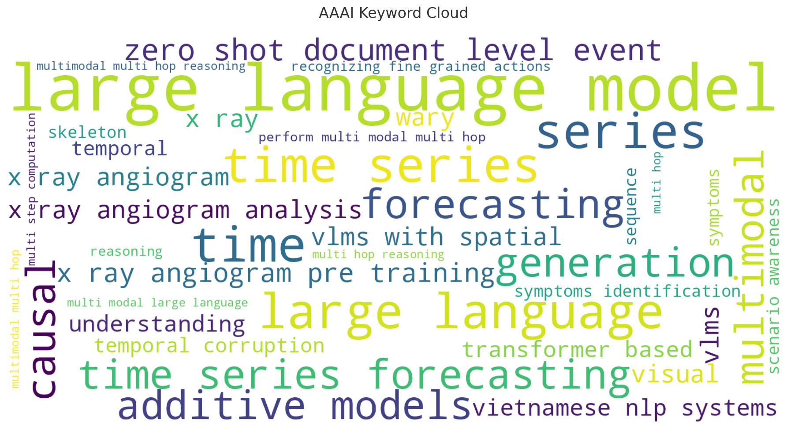
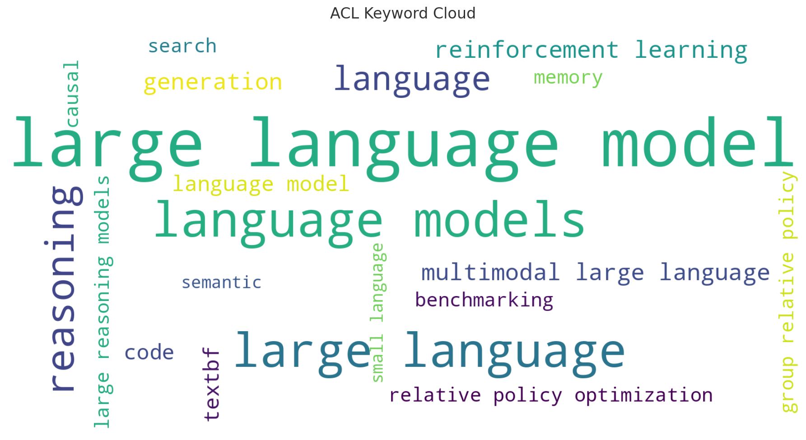
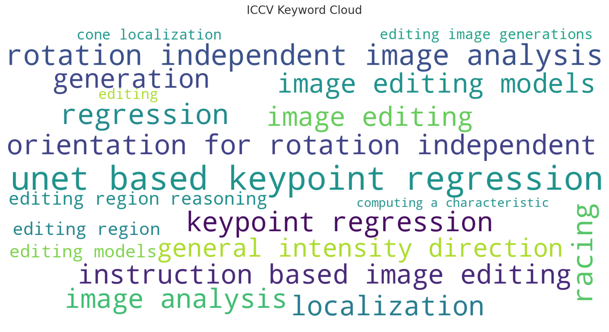
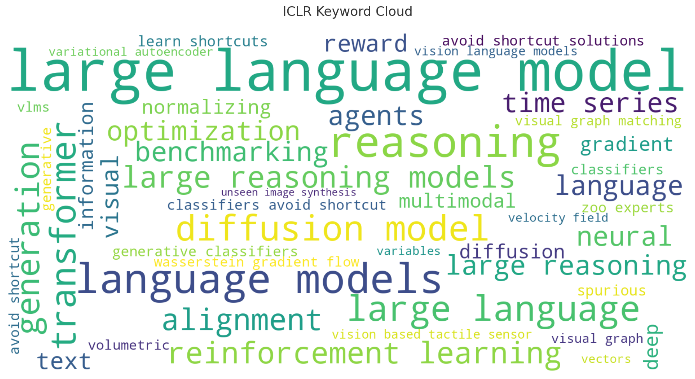
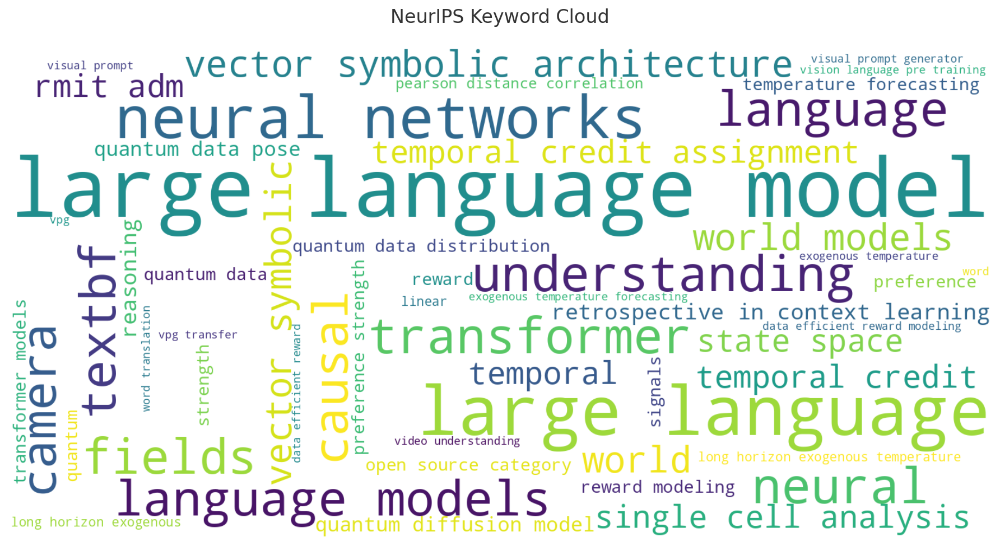
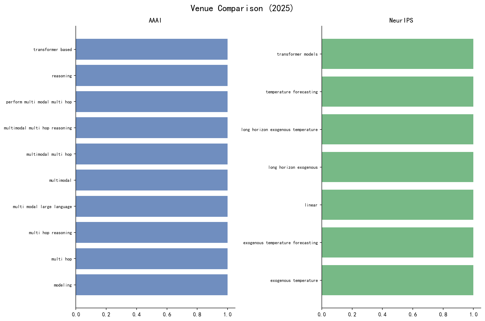

# 🔬 顶会论文关键词趋势报告

> 自动生成于 2025-12-19 01:58:00

## 📊 数据概览

| 指标 | 数值 |
|------|------|
| 论文总数 | 3,842 |
| 关键词总数 | 10,000 |
| 覆盖会议 | AAAI, ACL, CVPR, ICCV, ICLR, NeurIPS |
| 年份范围 | 2023 - 2025 |

## ☁️ 关键词云

## 🏆 Top 20 热门关键词

📋 完整列表（Top 50）

| 排名 | 关键词 | 出现次数 |
|------|--------|----------|
| 1 | large language model | 216 |
| 2 | diffusion model | 188 |
| 3 | generation | 175 |
| 4 | diffusion | 172 |
| 5 | image | 169 |
| 6 | video | 163 |
| 7 | large language | 137 |
| 8 | language models | 126 |
| 9 | detection | 104 |
| 10 | segmentation | 90 |
| 11 | object | 83 |
| 12 | language | 81 |
| 13 | human | 75 |
| 14 | visual | 73 |
| 15 | motion | 71 |
| 16 | object detection | 69 |
| 17 | gaussian splatting | 67 |
| 18 | scene | 66 |
| 19 | vision language models | 60 |
| 20 | gaussian | 59 |
| 21 | semantic | 59 |
| 22 | reasoning | 58 |
| 23 | reconstruction | 55 |
| 24 | neural | 50 |
| 25 | vision | 50 |
| 26 | synthesis | 48 |
| 27 | transformer | 46 |
| 28 | estimation | 45 |
| 29 | multimodal large language | 45 |
| 30 | images | 43 |
| 31 | semantic segmentation | 43 |
| 32 | adversarial | 42 |
| 33 | editing | 41 |
| 34 | understanding | 41 |
| 35 | depth | 40 |
| 36 | pose | 40 |
| 37 | point cloud | 39 |
| 38 | radiance fields | 38 |
| 39 | splatting | 37 |
| 40 | federated learning | 36 |
| 41 | multimodal | 36 |
| 42 | recognition | 36 |
| 43 | image generation | 35 |
| 44 | generative | 34 |
| 45 | neural radiance fields | 34 |
| 46 | vision language | 34 |
| 47 | neural radiance | 33 |
| 48 | point | 32 |
| 49 | pose estimation | 32 |
| 50 | text | 32 |

## 📈 关键词趋势

## 🚀 新兴关键词

以下关键词在最近一年增长显著：

1. **code**
2. **reinforcement**
3. **machine**
4. **quantum**
5. **relative policy optimization**
6. **machine learning**
7. **user**
8. **robot**
9. **unlearning**
10. **policy optimization**

## 📚 会议详情

### AAAI

| 年份 | 论文数 | Top 5 关键词 |
|------|--------|--------------|
| 2025 | 19 | reasoning, large language model, large language, language models, generation |

### ACL

| 年份 | 论文数 | Top 5 关键词 |
|------|--------|--------------|
| 2025 | 2 | systematic study, stories, sgm, safety glasses, safety |

### CVPR

| 年份 | 论文数 | Top 5 关键词 |
|------|--------|--------------|
| 2025 | 1 | zero shot portrait generation, zero shot identity preserved portrait, portrait generation, multi face fusion, identity preserved portrait generation |
| 2024 | 2755 | diffusion model, image, diffusion, generation, video |

### ICCV

| 年份 | 论文数 | Top 5 关键词 |
|------|--------|--------------|
| 2025 | 2 | tool selection, selection and integration, robust multi view camera, robust multi view, reasoning |

### ICLR

| 年份 | 论文数 | Top 5 关键词 |
|------|--------|--------------|
| 2025 | 1 | web environment, web, tree search, tree, search for autonomous |
| 2024 | 30 | diffusion model, normalizing, multimodal, information, gradient |

### NeurIPS

| 年份 | 论文数 | Top 5 关键词 |
|------|--------|--------------|
| 2025 | 18 | reasoning, linear, large language model, workflows vs agents, vision language reasoning |
| 2023 | 30 | large language model, neural networks, understanding, transformer, textbf |

## ⚖️ 会议对比 (2025)

---

*本报告由 [DepthTrender](https://github.com/your-repo/depthtrender) 自动生成*