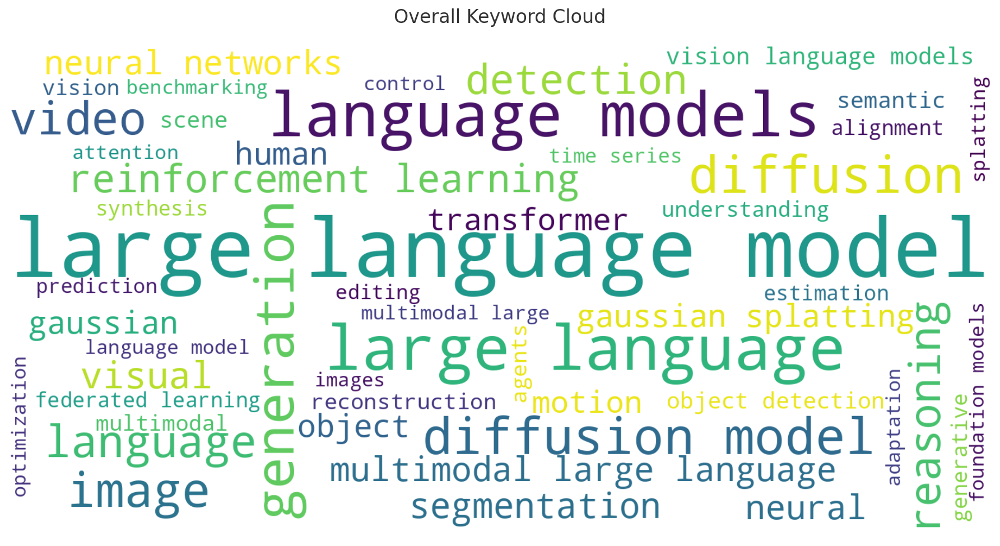
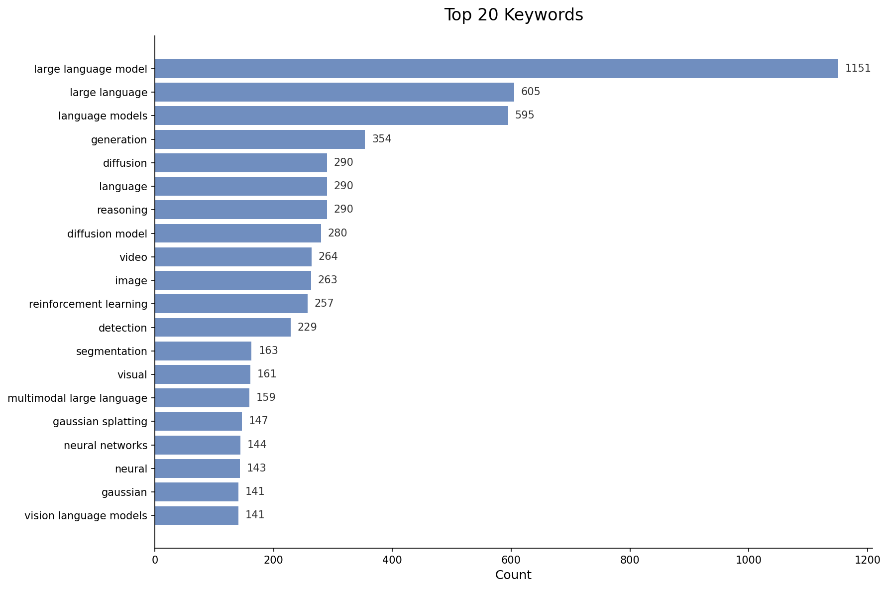
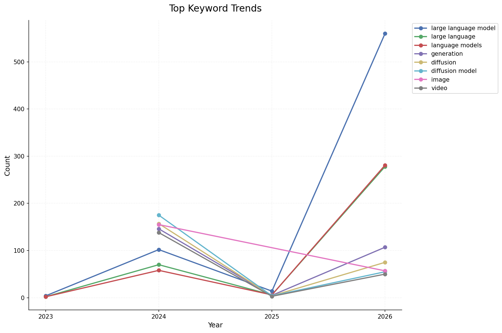
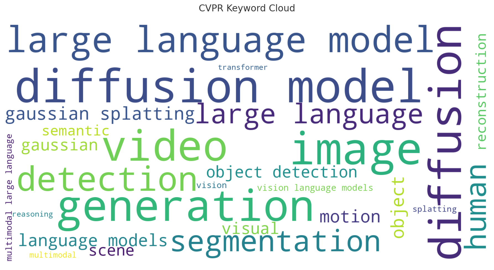
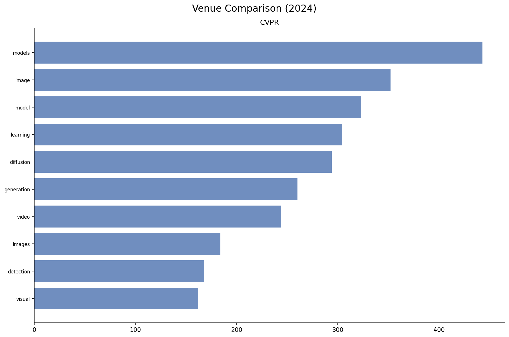

# 🔬 顶会论文关键词趋势报告

> 自动生成于 2025-12-12 09:02:27

## 📊 数据概览

| 指标 | 数值 |
|------|------|
| 论文总数 | 2,755 |
| 关键词总数 | 10,000 |
| 覆盖会议 | CVPR |
| 年份范围 | 2024 - 2024 |

## ☁️ 关键词云

## 🏆 Top 20 热门关键词

📋 完整列表（Top 50）

| 排名 | 关键词 | 出现次数 |
|------|--------|----------|
| 1 | models | 443 |
| 2 | image | 352 |
| 3 | model | 323 |
| 4 | learning | 304 |
| 5 | diffusion | 294 |
| 6 | generation | 260 |
| 7 | video | 244 |
| 8 | images | 184 |
| 9 | detection | 168 |
| 10 | visual | 162 |
| 11 | object | 160 |
| 12 | data | 160 |
| 13 | segmentation | 155 |
| 14 | diffusion models | 155 |
| 15 | scene | 128 |
| 16 | human | 123 |
| 17 | neural | 120 |
| 18 | motion | 114 |
| 19 | reconstruction | 113 |
| 20 | training | 112 |
| 21 | semantic | 105 |
| 22 | language | 105 |
| 23 | vision | 96 |
| 24 | tasks | 95 |
| 25 | large | 94 |
| 26 | language models | 94 |
| 27 | large language models | 92 |
| 28 | large language | 92 |
| 29 | estimation | 92 |
| 30 | dataset | 86 |
| 31 | videos | 85 |
| 32 | gaussian | 85 |
| 33 | multimodal | 82 |
| 34 | understanding | 80 |
| 35 | generative | 80 |
| 36 | methods | 79 |
| 37 | point | 76 |
| 38 | object detection | 75 |
| 39 | diffusion model | 75 |
| 40 | efficient | 73 |
| 41 | objects | 72 |
| 42 | gaussian splatting | 72 |
| 43 | synthesis | 71 |
| 44 | method | 71 |
| 45 | pose | 68 |
| 46 | dynamic | 68 |
| 47 | text | 66 |
| 48 | representation | 66 |
| 49 | scenes | 65 |
| 50 | vision-language | 62 |

## 📈 关键词趋势

## 📚 会议详情

### CVPR

| 年份 | 论文数 | Top 5 关键词 |
|------|--------|--------------|
| 2024 | 2755 | models, image, model, learning, diffusion |

## ⚖️ 会议对比 (2024)

---

*本报告由 [DepthTrender](https://github.com/your-repo/depthtrender) 自动生成*