# 🔬 顶会论文关键词趋势报告

> 自动生成于 2026-04-05 02:40:15

## 📊 数据概览

| 指标 | 数值 |
|------|------|
| 论文总数 | 9,947 |
| 关键词总数 | 58,851 |
| 覆盖会议 | AAAI, ACL, AIMOTION, AISTATS, ARR, AUAI, CVPR, DEEPLEARNINGINDABA, ECCV, EMNLP, HIGHLIGHTS-CONFERENCE, IACS, ICCV, ICLR, ICML, IJCAI, JDSE, NEURONOVEMBER, NeurIPS, PHILANDNEURO, RESYLAB, UIT |
| 年份范围 | 2023 - 2026 |

## ☁️ 关键词云

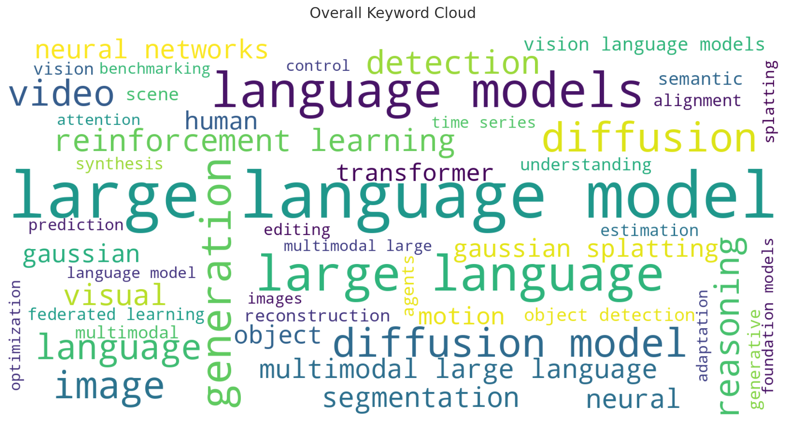

## 🏆 Top 20 热门关键词

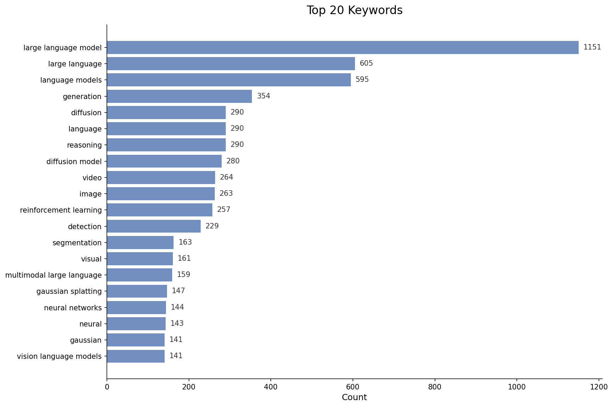

📋 完整列表（Top 50）

| 排名 | 关键词 | 出现次数 |
|------|--------|----------|
| 1 | large language model | 896 |
| 2 | language models | 472 |
| 3 | large language | 468 |
| 4 | generation | 303 |
| 5 | diffusion | 265 |
| 6 | diffusion model | 258 |
| 7 | language | 242 |
| 8 | reasoning | 236 |
| 9 | image | 235 |
| 10 | video | 227 |
| 11 | reinforcement learning | 200 |
| 12 | detection | 183 |
| 13 | segmentation | 142 |
| 14 | visual | 142 |
| 15 | gaussian | 127 |
| 16 | multimodal large language | 127 |
| 17 | gaussian splatting | 126 |
| 18 | neural | 123 |
| 19 | human | 121 |
| 20 | neural networks | 118 |
| 21 | vision language models | 117 |
| 22 | transformer | 113 |
| 23 | motion | 111 |
| 24 | object | 111 |
| 25 | agents | 101 |
| 26 | semantic | 101 |
| 27 | multimodal | 97 |
| 28 | scene | 94 |
| 29 | reconstruction | 93 |
| 30 | object detection | 89 |
| 31 | understanding | 89 |
| 32 | vision | 88 |
| 33 | generative | 87 |
| 34 | estimation | 86 |
| 35 | federated learning | 81 |
| 36 | alignment | 80 |
| 37 | attention | 76 |
| 38 | optimization | 76 |
| 39 | synthesis | 76 |
| 40 | control | 74 |
| 41 | time series | 74 |
| 42 | editing | 72 |
| 43 | foundation models | 72 |
| 44 | prediction | 71 |
| 45 | multimodal large | 68 |
| 46 | knowledge | 67 |
| 47 | splatting | 67 |
| 48 | language model | 66 |
| 49 | adaptation | 64 |
| 50 | benchmarking | 63 |

## 📈 关键词趋势

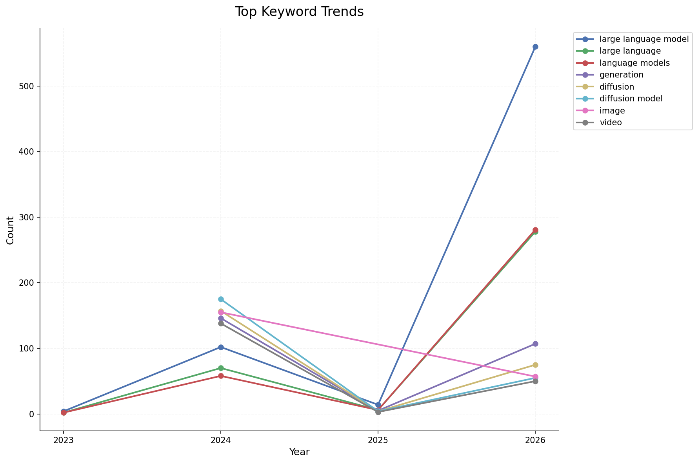

## 🚀 新兴关键词

以下关键词在最近一年增长显著：

1. **llm agents**
2. **agentic**
3. **series**
4. **code**
5. **relative policy optimization**
6. **machine**
7. **multi agent reinforcement learning**
8. **natural language processing**
9. **privacy**
10. **verification**

## 📚 会议详情

### AAAI

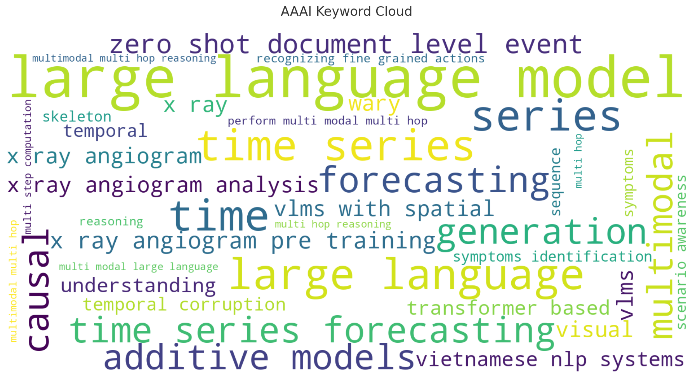

| 年份 | 论文数 | Top 5 关键词 |
|------|--------|--------------|
| 2026 | 39 | large language model, time series, time, series, large language |
| 2025 | 5 | multimodal, large language model, understanding, transformer based, temporal corruption |

### ACL

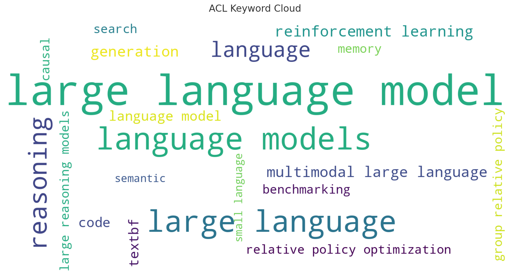

| 年份 | 论文数 | Top 5 关键词 |
|------|--------|--------------|
| 2026 | 6 | word sense induction, word sense disambiguation, word sense, word, translation models |

### AIMOTION

| 年份 | 论文数 | Top 5 关键词 |
|------|--------|--------------|

### AISTATS

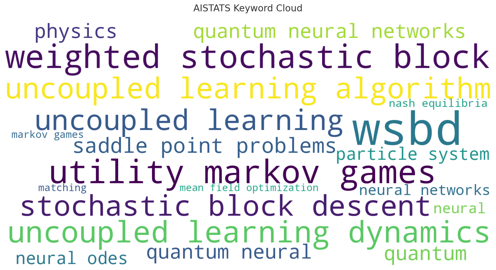

| 年份 | 论文数 | Top 5 关键词 |
|------|--------|--------------|
| 2026 | 12 | wsbd, weighted stochastic block, weak overlap, visualizing high dimensional data, visualizing |

### ARR

| 年份 | 论文数 | Top 5 关键词 |
|------|--------|--------------|

### AUAI

| 年份 | 论文数 | Top 5 关键词 |
|------|--------|--------------|

### CVPR

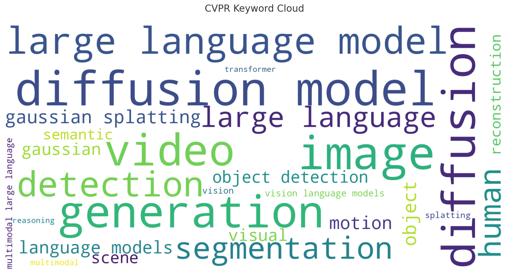

| 年份 | 论文数 | Top 5 关键词 |
|------|--------|--------------|
| 2026 | 253 | generation, large language model, video, image, diffusion |
| 2024 | 2755 | diffusion model, image, diffusion, generation, video |

### DEEPLEARNINGINDABA

| 年份 | 论文数 | Top 5 关键词 |
|------|--------|--------------|

### ECCV

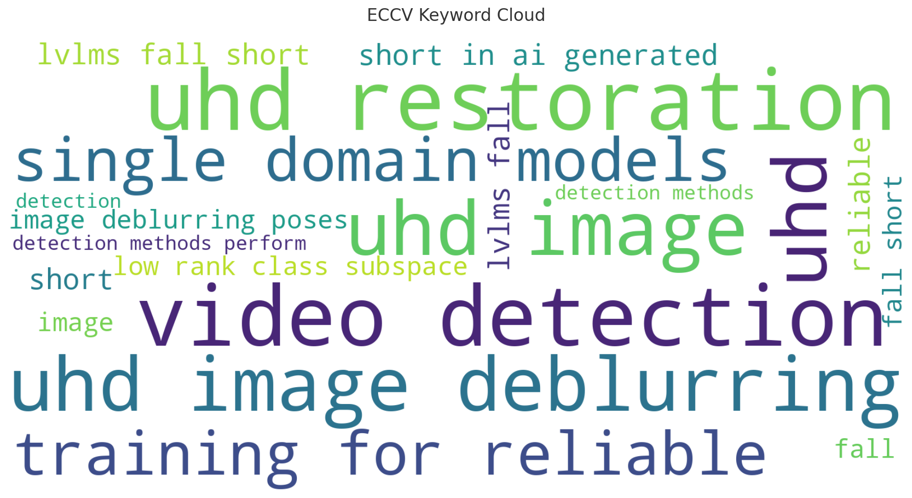

| 年份 | 论文数 | Top 5 关键词 |
|------|--------|--------------|
| 2026 | 3 | video detection, uhd restoration, uhd image deblurring, uhd image, uhd |

### EMNLP

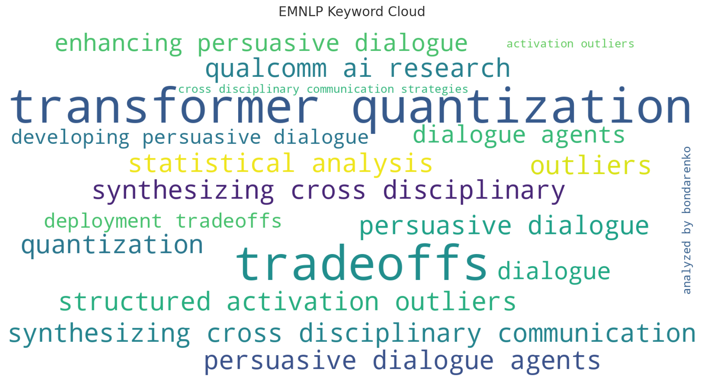

| 年份 | 论文数 | Top 5 关键词 |
|------|--------|--------------|
| 2026 | 3 | transformer quantization, tradeoffs, synthesizing cross disciplinary communication, synthesizing cross disciplinary, structured activation outliers |

### HIGHLIGHTS-CONFERENCE

| 年份 | 论文数 | Top 5 关键词 |
|------|--------|--------------|

### IACS

| 年份 | 论文数 | Top 5 关键词 |
|------|--------|--------------|

### ICCV

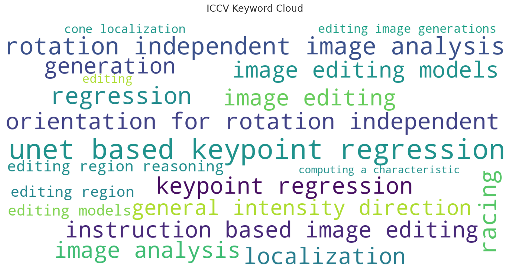

| 年份 | 论文数 | Top 5 关键词 |
|------|--------|--------------|
| 2026 | 3 | unet based keypoint regression, rotation independent image analysis, regression, racing, orientation for rotation independent |

### ICLR

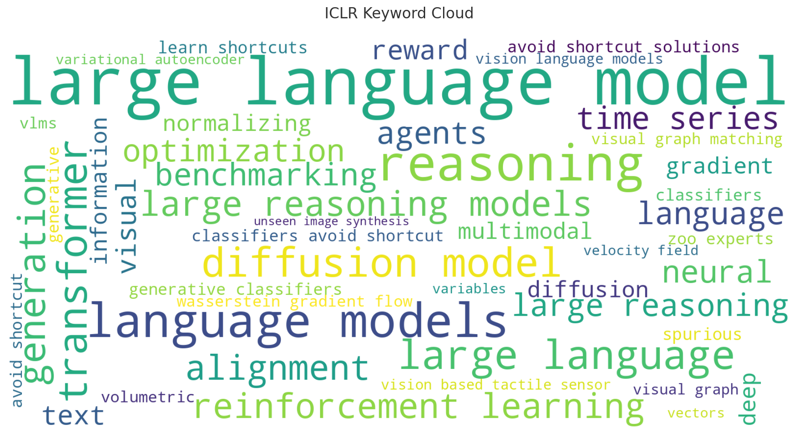

| 年份 | 论文数 | Top 5 关键词 |
|------|--------|--------------|
| 2026 | 186 | large language model, reasoning, language models, reinforcement learning, transformer |
| 2025 | 1 | spurious, learn shortcuts, generative classifiers, generative, classifiers avoid shortcut |
| 2024 | 30 | diffusion model, normalizing, multimodal, information, gradient |

### ICML

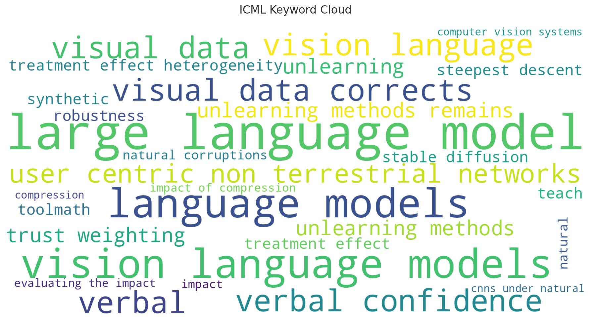

| 年份 | 论文数 | Top 5 关键词 |
|------|--------|--------------|
| 2026 | 12 | large language model, vision language models, language models, visual data corrects, visual data |
| 2025 | 1 | robustness, natural corruptions, natural, impact of compression, impact |

### IJCAI

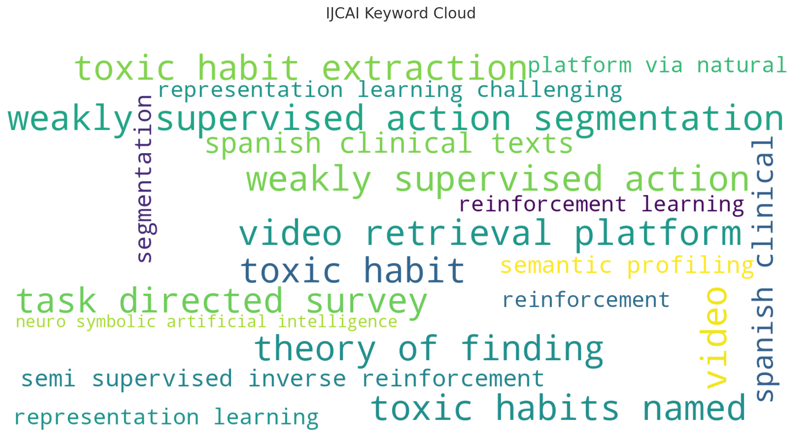

| 年份 | 论文数 | Top 5 关键词 |
|------|--------|--------------|
| 2026 | 2 | video retrieval platform, video, task directed survey, semantic profiling, platform via natural |

### JDSE

| 年份 | 论文数 | Top 5 关键词 |
|------|--------|--------------|

### NEURONOVEMBER

| 年份 | 论文数 | Top 5 关键词 |
|------|--------|--------------|

### NeurIPS

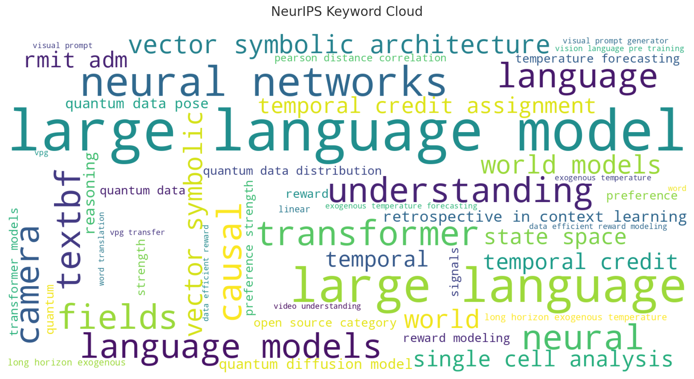

| 年份 | 论文数 | Top 5 关键词 |
|------|--------|--------------|
| 2026 | 12 | large language model, large language, world models, world, wavelet based cross band integration |
| 2025 | 2 | transformer models, temperature forecasting, strength, signals, reward modeling |
| 2023 | 30 | large language model, neural networks, understanding, transformer, textbf |

### PHILANDNEURO

| 年份 | 论文数 | Top 5 关键词 |
|------|--------|--------------|

### RESYLAB

| 年份 | 论文数 | Top 5 关键词 |
|------|--------|--------------|

### UIT

| 年份 | 论文数 | Top 5 关键词 |
|------|--------|--------------|

## ⚖️ 会议对比 (2026)

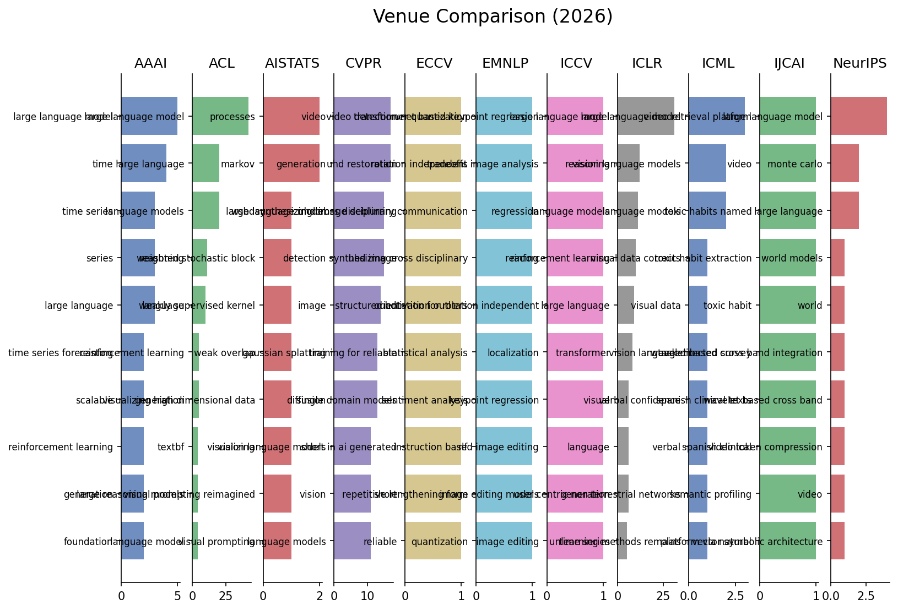

---

*本报告由 [DeepTrender](https://github.com/your-repo/deeptrender) 自动生成*