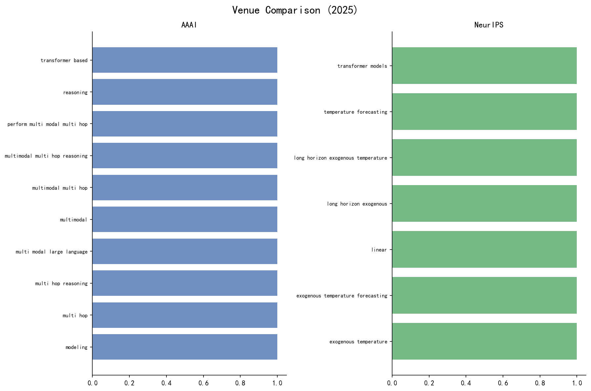

# 🔬 顶会论文关键词趋势报告

> 自动生成于 2026-02-16 18:49:23

## 📊 数据概览

| 指标 | 数值 |
|------|------|
| 论文总数 | 2,897 |
| 关键词总数 | 10,000 |
| 覆盖会议 | AAAI, AIMOTION, ARR, AUAI, CVPR, DEEPLEARNINGINDABA, HIGHLIGHTS-CONFERENCE, IACS, ICLR, JDSE, NEURONOVEMBER, NeurIPS, PHILANDNEURO, RESYLAB, UIT |
| 年份范围 | 2023 - 2025 |

## ☁️ 关键词云

## 🏆 Top 20 热门关键词

📋 完整列表（Top 50）

| 排名 | 关键词 | 出现次数 |
|------|--------|----------|
| 1 | diffusion model | 177 |
| 2 | diffusion | 159 |
| 3 | image | 155 |
| 4 | generation | 151 |
| 5 | video | 139 |
| 6 | large language model | 113 |
| 7 | detection | 90 |
| 8 | segmentation | 80 |
| 9 | large language | 77 |
| 10 | object | 76 |
| 11 | human | 70 |
| 12 | visual | 67 |
| 13 | language models | 63 |
| 14 | object detection | 63 |
| 15 | motion | 62 |
| 16 | scene | 60 |
| 17 | gaussian splatting | 59 |
| 18 | gaussian | 52 |
| 19 | semantic | 50 |
| 20 | vision language models | 49 |
| 21 | language | 48 |
| 22 | reconstruction | 48 |
| 23 | synthesis | 47 |
| 24 | vision | 46 |
| 25 | estimation | 42 |
| 26 | transformer | 42 |
| 27 | multimodal large language | 41 |
| 28 | images | 40 |
| 29 | semantic segmentation | 39 |
| 30 | editing | 37 |
| 31 | neural | 37 |
| 32 | point cloud | 37 |
| 33 | pose | 37 |
| 34 | understanding | 37 |
| 35 | adversarial | 36 |
| 36 | depth | 36 |
| 37 | radiance fields | 36 |
| 38 | splatting | 34 |
| 39 | image generation | 33 |
| 40 | neural radiance | 32 |
| 41 | neural radiance fields | 32 |
| 42 | vision transformer | 32 |
| 43 | multimodal | 31 |
| 44 | point | 30 |
| 45 | pose estimation | 30 |
| 46 | generative | 29 |
| 47 | recognition | 29 |
| 48 | text | 29 |
| 49 | vision language | 29 |
| 50 | adaptation | 28 |

## 📈 关键词趋势

## 🚀 新兴关键词

以下关键词在最近一年增长显著：

1. **generation**
2. **transformer**

## 📚 会议详情

### AAAI

| 年份 | 论文数 | Top 5 关键词 |
|------|--------|--------------|
| 2025 | 2 | transformer based, reasoning, perform multi modal multi hop, multimodal multi hop reasoning, multimodal multi hop |

### AIMOTION

| 年份 | 论文数 | Top 5 关键词 |
|------|--------|--------------|

### ARR

| 年份 | 论文数 | Top 5 关键词 |
|------|--------|--------------|

### AUAI

| 年份 | 论文数 | Top 5 关键词 |
|------|--------|--------------|

### CVPR

| 年份 | 论文数 | Top 5 关键词 |
|------|--------|--------------|
| 2024 | 2755 | diffusion model, image, diffusion, generation, video |

### DEEPLEARNINGINDABA

| 年份 | 论文数 | Top 5 关键词 |
|------|--------|--------------|

### HIGHLIGHTS-CONFERENCE

| 年份 | 论文数 | Top 5 关键词 |
|------|--------|--------------|

### IACS

| 年份 | 论文数 | Top 5 关键词 |
|------|--------|--------------|

### ICLR

| 年份 | 论文数 | Top 5 关键词 |
|------|--------|--------------|
| 2024 | 30 | diffusion model, normalizing, multimodal, information, gradient |

### JDSE

| 年份 | 论文数 | Top 5 关键词 |
|------|--------|--------------|

### NEURONOVEMBER

| 年份 | 论文数 | Top 5 关键词 |
|------|--------|--------------|

### NeurIPS

| 年份 | 论文数 | Top 5 关键词 |
|------|--------|--------------|
| 2025 | 1 | transformer models, temperature forecasting, long horizon exogenous temperature, long horizon exogenous, linear |
| 2023 | 30 | large language model, neural networks, understanding, transformer, textbf |

### PHILANDNEURO

| 年份 | 论文数 | Top 5 关键词 |
|------|--------|--------------|

### RESYLAB

| 年份 | 论文数 | Top 5 关键词 |
|------|--------|--------------|

### UIT

| 年份 | 论文数 | Top 5 关键词 |
|------|--------|--------------|

## ⚖️ 会议对比 (2025)

---

*本报告由 [DeepTrender](https://github.com/your-repo/deeptrender) 自动生成*